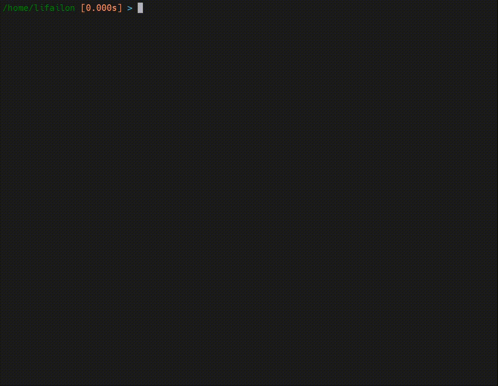
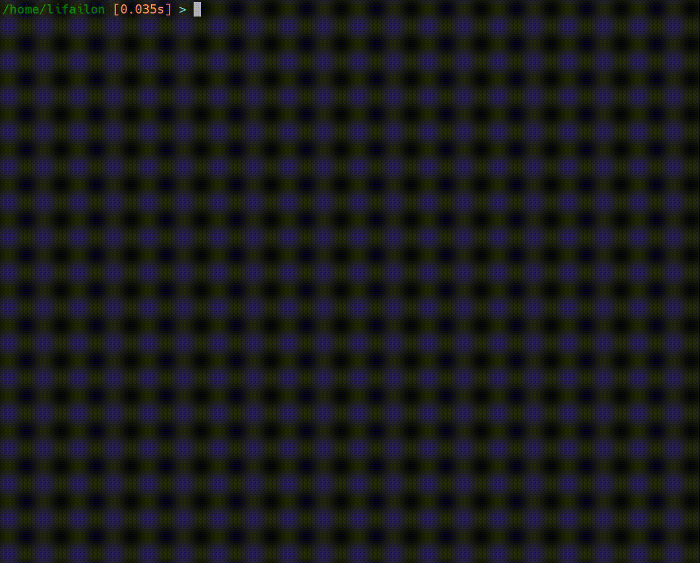

<h1 align="center">
  🧠 Intelli Shell 🐚
</h1>

<p align="center">
<a href="https://github.com/Lifailon/intellishell"></a>
<a href="https://github.com/Lifailon/intellishell"></a>
<a href="LICENSE"></a>
</p>

<p align="center">
    
</p>

This is a handler that runs on top of the Bash shell and implements command autocomplete using a dropdown list in real time.

You can view the history of executed commands with support for filtering and regular expressions, select and execute them from a list, and use directory navigation without leaving the current input line. In addition, it supports outputting variables, searching with filtering by the output of the last executed command, searching for executable commands and displaying a list of examples for them via [cheet.sh](https://github.com/chubin/cheat.sh).

<p align="center">
    

I created this little project to make working with the console easier and faster. I haven't been able to find a solution for passing commands within a single session (examples can be found in the [test](test/) directory).

> Because execution of each individual command occurs in external and independent processes, some actions may not perform as you expect. For example, calling functions again in subsequent commands is not supported, nor are any interactive scripts that require the user to provide input.

---

### ✨ Implemented:

- [x] History filtering (takes into account the order of execution with duplicates excluded) and running the selected command (using the `Enter` button) from a drop-down list in an *external process* with support for recording executed commands in the history.
- [X] Support for regular expressions during filtering, taking into account the position of entered phrases in the command using the `^` character at the beginning or end of a line (by default, the search is performed regardless of the position of entered phrases separated by a space).
- [x] Navigation through directories using `cd` and selecting files for reading via `cat`, `nano`, `vim` and `mcedit`, as well as copying via `cp` and `mv`.
- [x] Captures and displays the execution time of the last executed command in the spirit of `oh-my-bash`.
- [X] A mechanism for storing and passing variables of the current process to an external executable process has been implemented (**may work unstable**), and also output of all variables via the `$$` symbol is supported.
- [X] Integration with [cheat.sh](https://cheat.sh). Auto-complete search for executable commands using the `!` or output cheat sheets for the last command entered in the line.
- [X] Interactive [grep](https://www.gnu.org/software/grep). Performs a filtered search based on the output of the last command executed when the `@` character is used at the beginning of the input line. This can be used as an alternative to grep, which needs to be called every time the text in the filter query changes, or if you have previously used a soft terminal search but the output may have gone beyond it.

<p align="center">
    

To read the output of the last command, a **second thread is used**. To compare performance on my 1 core system I used `cat` to read the output of a 160k lines file which takes on average 4 seconds, when using two threads the reading time increases on 300-400 milliseconds.

Use two `!` characters at the end of a line and call it to get extended prompts with command comments or a brief syntax example, such as `js function !!` or `js functions !!`

### 💡 To do:

- [ ] Process all commands in **one persistent bash process** (for example, using `pexpect`).
- [ ] Automatic addition of options for commands after the `-` character at the end of a line (for example, using `compgen`).

### ⌨️ Hotkeys:

- `right` – select a command without executing it, which is convenient for continuing recording or moving to the next directory to quickly display its contents.
- `backspace` - in addition to deleting, updates the history to reflect the changes.
- `ctrl+c` - clears the current input line (buffer) without moving to a new line and does not terminate the executed command (has no effect on stopping a running program, which can also be interrupted).
- `ctrl+l` - completely clears the output console without affecting the input console and without changing the last execution command.
- `ctrl+q` - hides the drop-down list until the next input.

### 🚀 Install

To work, you need to install the Python [prompt-toolkit](https://github.com/prompt-toolkit/python-prompt-toolkit) library on the system, which is responsible for creating a drop-down list:

```shell
pip install prompt_toolkit
```

If you have any difficulties with installation, please refer to the [official manual](https://python-prompt-toolkit.readthedocs.io/en/stable/pages/getting_started.html#installation).

Other dependencies in the form of external libraries are not required.

Download the script to the system and set access rights:

```shell
mkdir -p ~/.local/bin
curl -s https://raw.githubusercontent.com/Lifailon/intellishell/rsa/src/insh.py -o ~/.local/bin/insh
chmod +x ~/.local/bin/insh
```

Add the directory with the executables to the `PATH` environment variable, if not already done:

```shell
export PATH="$HOME/.local/bin:$PATH"
source ~/.bashrc
```

To run, use the `insh` command. If you get errors, simply change in **hebang** the version of the Python interpreter for which the **prompt-toolkit** library was installed:

```shell
pythonVersion=python3.10
sed -i '1s|^.*|#!/usr/bin/env '"$pythonVersion"'|' ~/.local/bin/insh
insh
```