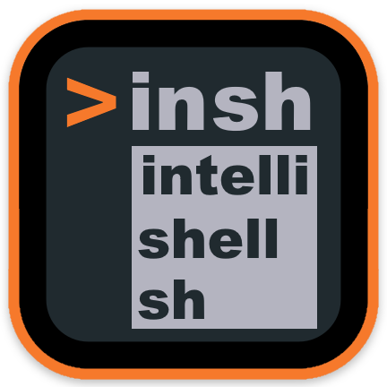
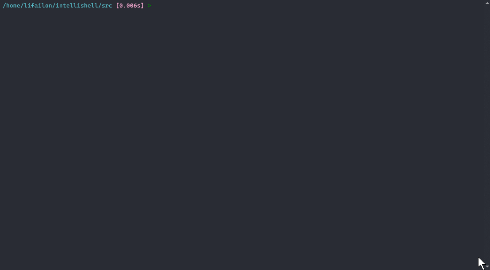

<h1 align="center">
    🧠 Intelli Shell 🐚
</h1>

<p align="center">
    <a href="https://pypi.org/project/intellishell"></a>
    <a href="https://github.com/Lifailon/intellishell"></a>
    <a href="https://github.com/Lifailon/intellishell"></a>
    <a href="LICENSE"></a>
</p>

<p align="center">
    
</p>

This is a handler running on top of the Bash shell that implements real-time command history completion from a drop-down list using the [Prompt Toolkit](https://github.com/prompt-toolkit/python-prompt-toolkit) library.

Why do need this when there are many other great solutions, such as [hstr](https://github.com/dvorka/hstr) and [mcfly](https://github.com/cantino/mcfly)? It's simple, I find it inconvenient to call a separate interface for navigating through history, I am used to using [PowerShell Core](https://github.com/PowerShell/PowerShell) in Windows or Linux (activated by pressing `F2`), which has become standard for me.

<p align="center">
    

## Install

For quick installation on your system, use the [PyPi](https://pypi.org/project/intellishell) package manager:

```shell
pip install --break-system-packages intellishell
```

To run use the command:

```shell
insh
```

## Completions

- History filtering (takes into account the order of execution with the exception of duplicates) and running the selected command by pressing the `Enter` key from the drop-down list or selecting it using the `right`.
- Regular expression support when filtering based on the position of the entered phrases in the command using the `^` symbol at the beginning or end of the line (by default, the search is performed regardless of the position of the entered phrases separated by spaces, like `fzf`).
- Quickly navigate through directories without leaving the current input line, as well as select files for reading or copying.
- Displays the execution time of the last executed command and the full path to the current directory.
- Supports completion of all available variables of the current session via the `$` symbol, as well as executable commands via the `!` symbol.
- Search based on the output of the last executed command when the `@` symbol is used at the beginning of the input line.
- Integration with [cheat.sh](https://cheat.sh) to output cheat sheets of the last entered command in a line via the `!` symbol.

To read the output of the last command, a second thread is used. To compare performance on my 1 core system I used `cat` to read the output of a 160k lines file which takes on average 4 seconds, when using two threads the reading time increases on 350 milliseconds.

## Hotkeys

- `right` – select a command without executing it, which is convenient for continuing recording or moving to the next directory to quickly display its contents.
- `backspace` - in addition to deleting, updates the history to reflect the changes.
- `ctrl+c` - clears the current input line (buffer) without moving to a new line and does not terminate the executed command (has no effect on stopping a running program, which can also be interrupted).
- `ctrl+l` - completely clears the output console without affecting the input console and without changing the last execution command.
- `ctrl+q` - hides the drop-down list until the next input.

## Issues

Because execution of each individual command occurs in external and independent processes, some actions may not perform as you expect.

Known issues and limitations:

- Multiline input is not supported.
- Interrupting some commands may not return the final result (for example, `ping` will not return statistics).
- Most interactive commands (which require input from user) may not work reliably.

## Backlog

- [x] Passing variables and functions between command calls is supported.
- [x] Added support for some interactive programs (e.g. `nano`, `vi/vim`, `top/htop`, `mc/mcedit`).
- [ ] Autocomplete parameters (flags/keys) for all commands (using source bash-completion and declare functions).

To fully utilize autocompletion for commands, it is recommended to use [inshellisense](https://github.com/microsoft/inshellisense) or [fzf-obc](https://github.com/rockandska/fzf-obc).
